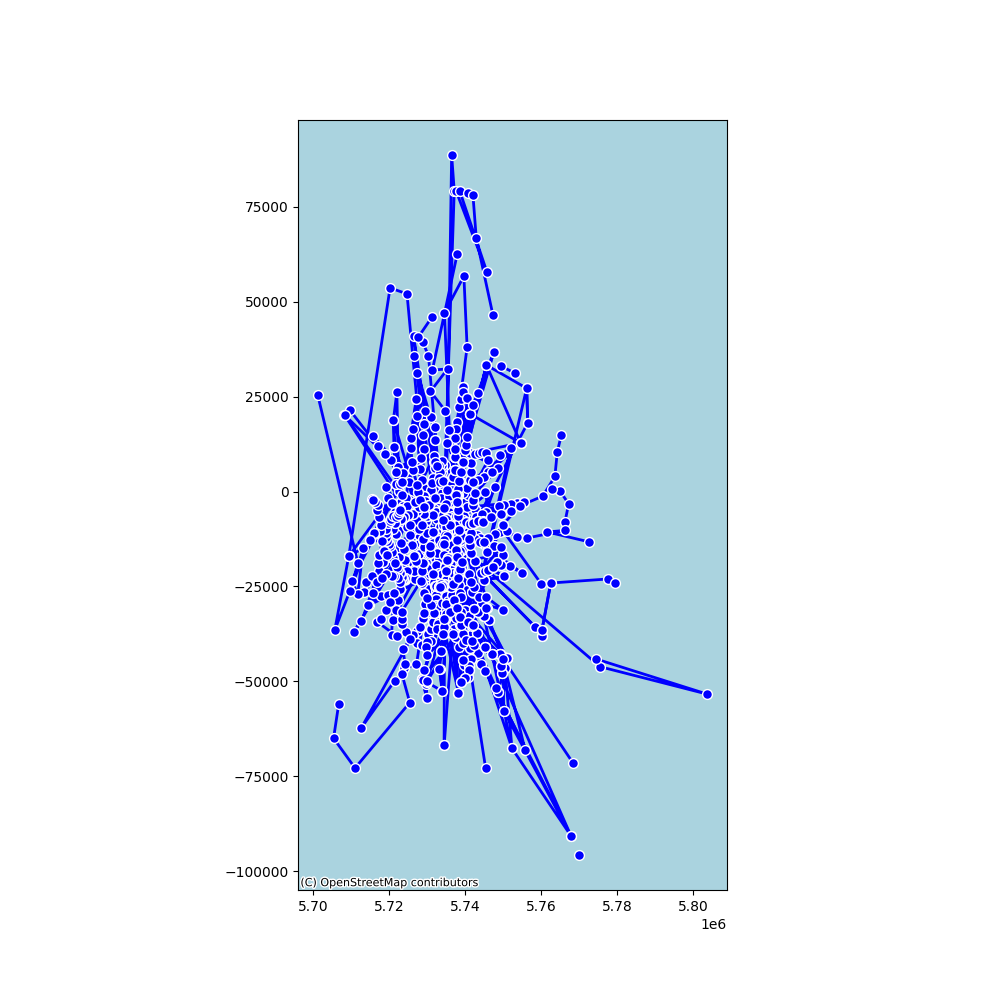

# Advance Networks Analytics - Data Science Master of ISCTE Business School of Lisbon 
This repository is were the support scripts for the study London transportation system networks are stored. Used to support a more detailed report for the Data Science Masters class, Advance Networks Analytics.

## Project Structure
### Data
Here lies all used datasets for this study.

### SRC
Here all python scripts used are stored.

## Plots

### Network Graph

### Geographical View

